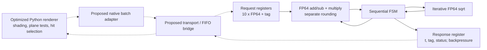

# Sequential FP64 ray–sphere accelerator

This is the hardware proposal for Project.pdf section 7 (pages 4–5). The
repository now contains the complete arithmetic datapath and controller for one
ray–sphere query in SystemVerilog, including licensed floating-point RTL. It is
a course design, not a measured accelerator or a deployed renderer backend.
Syntax/elaboration and host-side checks passed. No HDL simulation, synthesis,
place-and-route, physical test, or hardware timing measurement has been performed.

## Why this boundary

The upstream raytrace profile records 179,457 calls to
`Sphere.intersectionTime` in a 100×100 frame. That is a useful repeated geometric
operation with explicit inputs and an explicit result. However, much of the
Python cost is the calls, attribute accesses and temporary objects surrounding
its arithmetic. Offloading only a multiply or square root per Python call would
keep most of that work and add transport overhead. A batch interface would need
to remove the complete intersection operation from the Python inner loop.

The current software comparison reports 789.7555 ms/frame upstream versus
611.02275 ms/frame for shadow-ray reuse (22.63% lower time; source:
`results/comparison_raytrace_20260920-015451/summary.txt`). Hardware estimates
below use the **optimized** 611.02275 ms as their starting point. The older
sphere-call count is a planning input; new optimized profiles and a real batch
implementation are needed to establish the actual offloaded time and query
count. Native samples collected using `python3-dbg` do not supply a release-time
Amdahl fraction or a fixed instruction cost per Python call.

The design is deliberately sequential: one shared add/subtract unit, one shared
multiplier and one iterative square-root unit make the operation/control
boundary easy to inspect. It is a modest architecture whose costs can be
estimated without inventing a 1 GHz pipeline or assuming one result per cycle.

## Exact operation implemented

Inputs are an origin `o`, a direction `d` that software has already normalized,
a sphere center `c`, and radius `r`. The accelerator implements the same
expression tree as upstream `Sphere.intersectionTime`:

```text
cp.x = c.x - o.x; cp.y = c.y - o.y; cp.z = c.z - o.z
v = ((cp.x*d.x) + (cp.y*d.y)) + (cp.z*d.z)
q = ((cp.x*cp.x) + (cp.y*cp.y)) + (cp.z*cp.z)
disc = (r*r) - (q - (v*v))
if disc < 0: return no_root
else:        return v - sqrt(disc)
```

Every arithmetic result is rounded to IEEE binary64 using nearest-even, with
gradual underflow. There is no fused multiply-add, reciprocal-square-root
approximation, reassociation, precision reduction or direction normalization.
The multiplication/addition order within each expression is preserved. `q`
and `r*r` are independent, so their schedule has no effect on the result.
`has_root` means a nonnegative discriminant, **not** a positive ray distance.
A negative `t` must be returned for the renderer to filter using its existing
rules. In particular, the module does not clamp `t`, apply `EPSILON`, choose a
far root, or reject a tangent (`disc` equal to positive or negative zero).

The supported agreement domain is finite FP64 inputs, nonnegative radius,
normalized direction supplied by the caller, and finite intermediate results.
Subnormal numbers and signed zeros are permitted. Input NaNs/infinities,
negative nonzero radii, or a nonfinite intermediate produce `error=1` and no
root. Invalid-operation, divide-by-zero and overflow flags also produce an
error. Software must fall back to its CPU path for such responses. Inexact and
underflow are reported and do not, by themselves, invalidate a finite result.
The RTL does not independently check the direction length. Matching Python
pixels is a future hardware/integration acceptance test; source-level ordering
and a matching host reference are not a proof that this RTL is correct.

## Block diagram

Solid paths below are implemented in RTL. Dotted paths require a future host
integration/transport; no DMA engine or working driver is claimed.



The separate diagram source is `hardware/architecture.mmd`.

## Interface and reset contract

Top module: `hardware/rtl/ray_sphere_accel.sv`.

| Port | Width | Meaning |
|---|---:|---|
| `clk` | 1 | Rising-edge clock; analytical target 50 MHz, not achieved timing |
| `rst_n` | 1 | Asynchronous active-low reset; deassert synchronously to `clk` |
| `in_valid`, `in_ready` | 1 each | Accept request only on an edge with both high |
| `in_data` | 640 | Ten IEEE binary64 words in the order below |
| `in_tag` | 32 | Opaque request identifier, returned unchanged |
| `out_valid`, `out_ready` | 1 each | Consume response only on an edge with both high |
| `out_t` | 64 | IEEE binary64 near root; zero for miss/error |
| `out_tag` | 32 | Accepted request tag |
| `out_has_root` | 1 | A valid finite root, including a negative root |
| `out_error` | 1 | Unsupported input or failed arithmetic; request CPU fallback |
| `out_exception_flags` | 5 | Sticky OR: invalid, divide-by-zero, overflow, underflow, inexact (bits 4 down to 0) |

`in_data[64*i +: 64]` contains word `i`: origin x/y/z (0–2), normalized
direction x/y/z (3–5), center x/y/z (6–8), radius (9).

There is one request in flight. A producer holds its request and `in_valid`
until acceptance. The core deasserts `in_ready` while busy, and holds every
response field stable while `out_valid && !out_ready`. It returns to idle only
after the response is consumed; it cannot simultaneously retire one response
and accept another request. Reset aborts any transaction, clears visible
outputs, resets the square-root core, and suppresses both handshakes. A host
must resubmit aborted work after reset. Internal datapath registers are loaded
before use rather than individually reset.

Bad input is a protocol/domain error and may have zero floating-point exception
flags; `out_error` must be checked separately. `out_has_root` and `out_error`
never intentionally assert together. The current design uses no interrupts,
clock-domain crossing, external memory, caches, or operating-system facilities.
A transport must perform any required synchronization outside this core.

## Datapath and control sequence

`fp64_binary.sv` adapts HardFloat add/subtract and multiply to 64-bit IEEE
ports. `fp64_sqrt.sv` adapts its iterative square-root unit. Arithmetic units
are real RTL from Berkeley HardFloat Release 1; the design does not use
SystemVerilog `real`, `$sqrt`, a software callback or a black-box FPU stub.

| FSM region | Work |
|---|---|
| IDLE | Validate/capture ten words and tag, clear status |
| CALCULATE steps 0–2 | Three center-minus-origin subtractions |
| Steps 3–7 | Three direction products and two left-associated additions |
| Step 8 | Radius squared |
| Steps 9–13 | Three coordinate squares and two left-associated additions |
| Steps 14–16 | `v*v`, `q-v*v`, then `r*r-(q-v*v)` |
| CHECK_DISC | Return miss for strictly negative discriminant |
| SQRT_ISSUE / SQRT_WAIT | Respect HardFloat input handshake; capture its one-cycle result pulse |
| FINAL_SUBTRACT | Rounded `v-sqrt(disc)` |
| RESPONSE | Retain data and status until the consumer accepts them |

The root-bearing path performs eight multiplies, ten add/subtract operations,
one comparison and one square root. Shared arithmetic results are registered
between steps. Neither an adder tree nor multiple parallel multiplier lanes
are instantiated. The two binary arithmetic units can still toggle together
when operands change; operand isolation is a possible power improvement, not
an implemented power-gating claim.

## Software packing and integration boundary

`hardware/host/interface.py` provides packing/decoding and an independent
scalar expression reference. No benchmark imports it; it does not communicate
with hardware. An eventual native extension would accept contiguous batches,
submit them through a platform-specific transport, and return ordered results.
The transport could be an on-chip stream bridge or a device FIFO serviced by a
kernel driver. Bus addresses, DMA descriptors, interrupt wiring and physical
link bandwidth depend on a platform that has not been selected; they are not
fabricated in this proposal.

A transport adapter maps the following record layout onto the ready/valid ports.
All byte fields are little-endian; this byte convention does not change IEEE
word bit numbering in RTL.

| Request byte offset | Size | Contents |
|---|---:|---|
| 0–79 | 80 | Ten FP64 words in `in_data` order |
| 80–83 | 4 | Unsigned request tag |
| 84–87 | 4 | Reserved zero padding |

| Response byte offset | Size | Contents |
|---|---:|---|
| 0–7 | 8 | FP64 `t` (zero for miss/error) |
| 8–11 | 4 | Unsigned tag |
| 12–15 | 4 | bit 0 `has_root`, bit 1 `error`, bits 6–2 exception flags; remaining bits zero |

Simply replacing each Python `intersectionTime` call with a device submission
would introduce 179,457 small transfers in the old profile. A credible
integration instead accumulates currently ready rays in a tile/frontier and
processes their sphere queries through one native batch call. Plane tests,
nearest-hit selection, shading, recursion limits and epsilon rules remain
unchanged. Results must be reduced in original object order so equal-distance
and visibility decisions preserve semantics.

Primary rays can be batched easily; reflection and shadow rays become available
only after earlier work. Batching all sphere queries can also evaluate pairs
that upstream's early-exit visibility loop would have skipped. Therefore the
future batch count and query count cannot be assumed equal to the old profile.
The analytical model exposes both assumptions. Packing must happen in a native
loop for the assumed per-record cost to be credible; constructing each packed
record in Python would need a new measured cost. Hardware and compiled CPU
batch backends should share this exact interface, so any benefit of escaping
Python can be separated from the value of the hardware itself.

## Analytical timing and sensitivity

No frequency, latency, throughput or speedup in this section was measured.
A **50 MHz target** assumes each complete combinational FP64 add/multiply path
fits a 20 ns cycle. That requires synthesis/timing analysis to establish; the
course does not require doing so. If it fails, the clock must be slowed or the
arithmetic units must be pipelined and the FSM/latency model updated.

From the RTL schedule, a miss presents its response 18 cycles after request
acceptance and can accept the next request 20 cycles after that acceptance
when the consumer is always ready. In the supplied HardFloat square-root source,
`cycleNum` begins at at most `sigWidth+1 = 54` and decreases to its result pulse.
Including the controller gives a derived maximum of 74 cycles to present a
normal root and 76 cycles between requests; this is a code-derived estimate,
not a simulation result. We budget **80 cycles/root** and **20 cycles/miss**.
External backpressure adds unbounded stall time and must be counted separately.

Use `python3 -B hardware/estimate.py` to reproduce the sensitivity calculation:

```text
C = (1-h)*20 + h*80                         h = root-bearing fraction
Tcore = N*C / frequency
Ttransfer = N*(88+16) / bandwidth
Tlaunch = ceil(N/batch_size)*launch_cost
Tpack = N*packing_cost_per_query
Toffload = Tcore + Ttransfer + Tlaunch + Tpack
Tnew = Tsoftware*(1-f) + Toffload            f = removed release-runtime fraction
```

This conservative sum assumes no overlap between transfer and computation;
a transport that overlaps them needs a revised, justified model. The example
uses N=179,457, 50 MHz, 1 GB/s aggregate payload bandwidth, batches of 1,024,
10 microseconds of launch cost per batch, and 100 ns native packing cost per
query. These are assumptions, not platform specifications. Baseline for the
comparison is the measured shadow-ray software time, 611.02275 ms/frame.

| Assumed root fraction h | Assumed removed fraction f | Estimated new time | Time reduction vs optimized software |
|---:|---:|---:|---:|
| 0.5 | 0.3 | 645.542 ms | -5.65% (slower) |
| 0.5 | 0.5 | 523.338 ms | 14.35% |
| 0.5 | 0.7 | 401.133 ms | 34.35% |
| 1.0 | 0.3 | 753.216 ms | -23.27% (slower) |
| 1.0 | 0.5 | 631.012 ms | -3.27% (slower) |
| 1.0 | 0.7 | 508.807 ms | 16.73% |

With every query root-bearing, modeled offload costs 325.500 ms and must remove
more than 53.27% of optimized software time just to break even. We do not know
that fraction yet. The model therefore demonstrates both a possible useful
region and a plausible losing region; it does not establish an expected
measured gain. Increasing actual query count, reducing batch size, slower
packing, a slower clock or a faster compiled CPU comparator can eliminate the
advantage. Reporting only arithmetic latency would hide these costs.

## Area, power, and alternatives

The design pays for one FP64 add/subtract path, one FP64 multiplier, one
iterative square-root path, conversion/rounding logic, registers, muxes and a
small FSM. No numerical area, power, energy or process-node claim is justified
without a technology and synthesis/library data. Reuse reduces replicated
arithmetic area but increases latency and decreases throughput. A pipelined or
multi-lane design would cost more registers/arithmetic/control and raise
potential switching activity; its value depends on available batch parallelism
and transport bandwidth. FP32, approximate reciprocal square root and FMA
could change final pixel bytes, so this version retains FP64 and separate
rounding.

We defer nbody hardware. Its authentic kernel computes a nonintegral power
`d2 ** (-1.5)` through the host runtime/library. Replacing that with reciprocal
square root changes rounding and is a different arithmetic variant. A strict
bit-identical nbody accelerator would need a defined implementation of that
power operation plus ordered dependent velocity updates, beyond the present
ray–sphere core. This proposal does not claim one approximate arithmetic unit
preserves both benchmarks.

## Validation, provenance, and remaining checks

- `hardware/check_syntax.py`: full top-level syntax/elaboration using pyslang
  11.0.0 passed with zero errors and one narrowly downgraded upstream warning.
  Original HardFloat declares its `sqrtOpOut` output again as a wire; slang's
  `redefinition` diagnostic is downgraded to a warning. Vendor files are
  unmodified, and all other errors retain their default severity.
- `hardware/host/check_interface.py`: 256 deterministic host-expression/packing
  cases agree with the unchanged upstream formula, plus tangent/interior/miss
  and nonfinite-input checks. This exercises Python packing/reference code,
  **not** RTL behavior or the future driver.
- `hardware/vendor/HardFloat-1/PROVENANCE.json`: official archive URL/hash and
  SHA-256 of every copied source. All copied files retain their copyright and
  BSD license notices. Only required operations and their dependencies are
  vendored; no generated hardware binaries are committed.
- `hardware/validation.json`: machine-readable check status and limitations.

Before claiming hardware correctness or speed, independently exercise RTL
normal/miss/tangent/negative-root cases, signed zeros, subnormals, near-tangent
rounding, flags, reset while busy, input/output stalls and long batches; compare
rendered bytes through the integrated path; establish timing and actual
transport costs. Those are future validation steps. HDL simulation is not
performed in this work, as requested.

Primary source: [Berkeley HardFloat Release 1 documentation](https://www.jhauser.us/arithmetic/HardFloat-1/doc/HardFloat-Verilog.html).
The official archive and license provenance are recorded with the vendored code.
